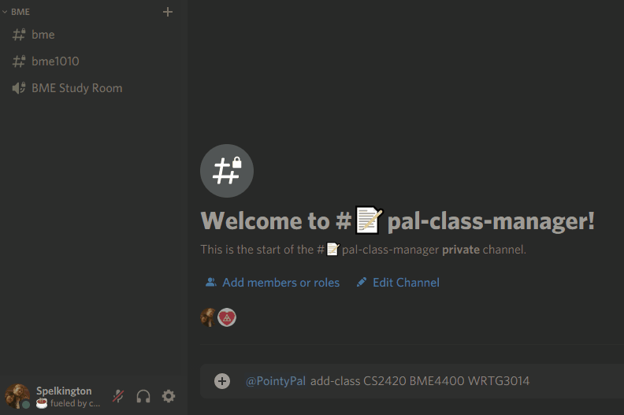

# PointyPal: Zoom School Done Better

---

**You can add PointyPal to your Discord Server at [pointypal.utahtriangle.org](https://pointypal.utahtriangle.org)!**

---

PointyPal is a student-run Discord application project sponsored by Utah Triangle at the University of Utah. The application allows University-oriented Discord servers to host class and department-specific channels and voice chats. **PointyPal keeps class channels and chats visible only to those who are in these classes** and departments, keeping your server tidy for everybody.

While designed for University of Utah organizations in mind, development will continue to move towards supporting **any University's class structures.**

The largest PointyPal community, exclusive to University of Utah students, is hosted at [campus.utahtriangle.org](https://campus.utahtriangle.org). During its' release term in Fall 2020, PointyPal supported this community of **400** University of Utah students in **93 classes across 30 majors**, contributing a total of **11,000 messages** and **1,900** hours of voice chat.

## Adding PointyPal to Your Server

With the entire source code available here, anybody is welcome to host their own instance of PointyPal. However, Utah Triangle hosts an instance of PointyPal for free.

### Easy Install

Adding the Utah Triangle version of PointyPal to your server is easy! For a quick set-up, go to [pointypal.utahtriangle.org](https://pointypal.utahtriangle.org) and grant the bot the necessary permissions. Once finished, you'll receive a notification that PointyPal was added to your server successfully.

### Manual Install

In order to host your own version of PointyPal, you'll need to:

* [Create a Discord Bot and retrieve its' API Key](https://www.writebots.com/discord-bot-token/)
* Have a 24/7 computer that is able to run Python 3.*.
    - To install the necessary dependencies, create a new virtual environment and run `pip install -U discord.py dotmap pyyaml`
* Create a clone of this repository onto your computer.

Once you have the environment set up, you can run your instance of PointyPal by:

1. Renaming `configs/secrets.yaml.sample` to `configs/secrets.yaml` and replacing the sample token with your Discord Bot API Token
2. Running `bot.py`

Once the bot is running and added to your Discord server, you can `@` the bot to ensure everything is in working order!

### General Commands

* `@PointyPal join-class [CLASS CODES]`
    - Adds a student to a text channel specific to the given class, along with the text and voice channel for that class's department.
        - Valid class codes always take the form of letters followed by numbers, with **no space** in between.
            * `CHEM1400`, `PHYS101`, and `ECON2000` are all **valid** class codes.
            * `CS 2000` is not a valid class code, due to the space in between the department tag and the course number.
        - To prevent spam, valid course codes are restricted to **2-6 letters** and **3-5 numbers.**
            * e.g., `PHYSICS1000`, with 7 letters, would not be valid.
        - One `join-class` command can add up to 5 classes at once.

* `@PointyPal drop-class [CLASS CODES]`
    - Removes a student from the class text chat for the given class, if one exists..
        - One `drop-class` command can remove a student from any number of classes.
        - Students that use `drop-class` can still join that class again in the future.

* `@PointyPal join-department [DEPARTMENT CODE]`
    - Adds a student to the text and voice chats for a given department.
        - Department codes are limited to **6 letters.**
        - Students that use `drop-class` can still join that class again in the future.

* `@PointyPal drop-department [DEPARTMENT CODE]`
    - Removes a student from **all** channels in a department.
        - Students that use `drop-department` can still join that class again in the future.

## Administrator Commands

These administrator commands will only be accepted by users that have both the server-wide **Manage Messages** and **Manage Channels** permissions.

* `@PointyPal place-in-class @User [CLASS CODES]`
    - Performs the `join-class` command on behalf of another user, subject to the same structure and limitations.

* `@PointyPal place-in-department @User [DEPARTMENT CODE]`
    - Performs the `join-department` command on behalf of another user, subject to the same structure and limitations.

* `@PointyPal delete-class [CLASS CODES]`
    - **Permanently deletes** the given class chats.

* `@PointyPal delete-department [DEPARTMENT CODE]`
    - **Permanently deletes** the **entire** category for the given department, **including all classes**.
        - This command was designed specifically for clearing out all previous classes at the end of each term.

## Backwards Compatibility

Have you already been managing student classes by hand? Because PointyPal is a stateless application, it can accommodate structures that servers already have in place with some adjustment!

Across the board, all PointyPal departments and classes are structured in the following way:

- \> PHYS
    - \# phys
    - \# phys1010
    - \# phys2010
    - 🔊 PHYS Study Room

PointyPal operates off a system where the department Category Channel is an all-capitalized abbreviation, and class text chats are lower-cased version of the class code. So long as departments and classes are structured that way **and are visible to PointyPal**, PointyPal can automatically add students into your already-existing class chats.

## Privacy

PointyPal itself is a **stateless application** - no data is stored outside of Discord itself. The application will remain that way for the foreseeable future. As such, no data is or will be stored anywhere while the application is running.

While the bot is active, it retains the ability to view and modify the specific channels it manages. However, it is not necessary to make the rest of the server visible to the bot. We would encourage you to **limit the non-class channels PointyPal has access to** by reducing how much its' bot Role can see.

The permissions given to PointyPal by default are the minimum necessary to provide a polished experience. You are able to modify these permissions, but **we cannot guarantee PointyPal will function properly if you modify the permissions necessary for it to function.**

## Warranty

As a student-driven project, PointyPal is largely a learning experience. It has been tested for stability for a number of months at [campus.utahtriangle.org](https://campus.utahtriangle.org). However, **use of PointyPal to manage class channels is done so at your own risk, and with no guarantee.** We encourage server owners to take the proper precautions, as they should with any third-party application, by limiting the portion of the server PointyPal has access to as much as possible. 

## Future Additions

In the future, we'd like to add functionalities for:

- Whitelisting department names to avoid [this](assets/daddy101.png)

## Removing PointyPal

If you are going to remove PointyPal, we strongly encourage that you **utilize the administrator commands** to clean your server of all PointyPal-managed channels prior to removal. Once PointyPal is removed, all PointyPal-managed channels will need to be removed by hand. Re-adding the bot will not fix this issue.

---

If you do encounter issues with PointyPal, we encourage you to contact either:

* [chapter@utahtriangle.org](mailto:chapter@utahtriangle.org) - Utah Triangle's contact email; or
* [spelkington@gmail.com](mailto:spelkington@gmail.com) - Spencer Elkington, PointyPal's lead developer.
